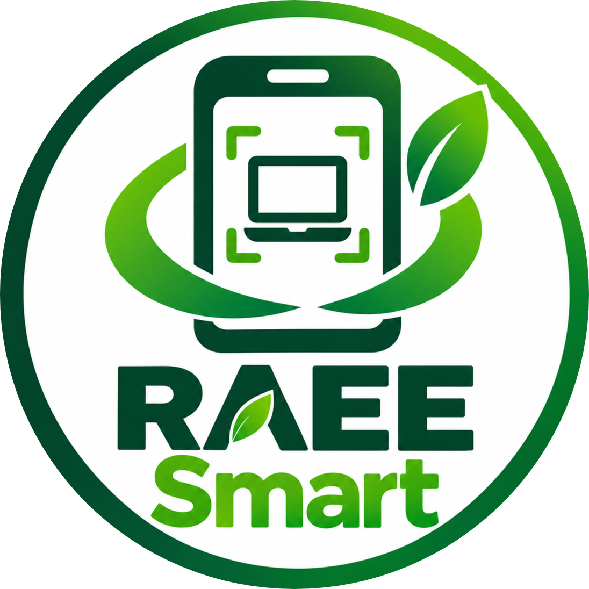

  
    
  
<strong>Plataforma de reciclaje de residuos de aparatos eléctricos y electrónicos (RAEE) con clasificación por IA, certificación digital con QR y reportes municipales</strong>

  
  
  
  
  
  
  

